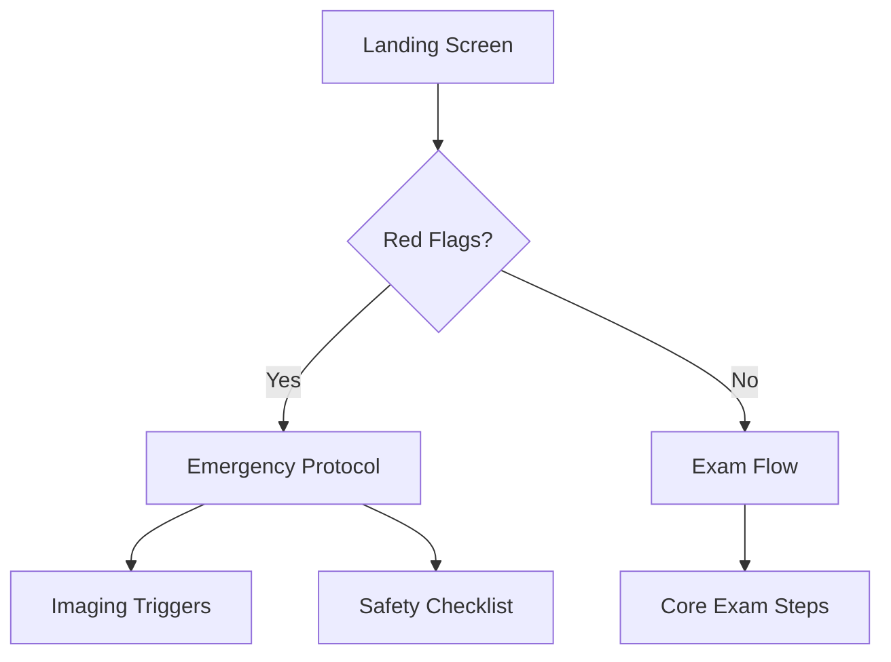
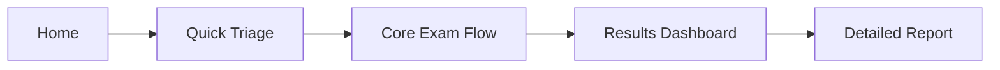

# NeuroLocal UX Specification

## Product Vision
NeuroLocal is a mobile-first point-of-care web application that transforms bedside neurological examination into instant, probabilistic lesion localization and dynamic differential diagnoses. Through an intuitive interface that requires no more than 7 taps, clinicians receive:

- Real-time lesion localization with confidence intervals
- Dynamically ranked differential diagnoses with red-flag alerts
- Micro-learning explanations linking findings to anatomical reasoning

### Core Value Proposition
"From physical exam to precise neuroanatomical diagnosis in seconds, not minutes – while learning as you work."

## Clinical Decision Flow

### 1. Initial Triage Flow


### 2. Core Examination Steps (≤7 Interactions)
1. **Mental Status** (1 tap)
   - GCS components as quick-select chips
   - Orientation status toggle

2. **Cranial Nerves** (2 taps)
   - Grid-based CN selector
   - Abnormal findings detail sheet

3. **Motor Function** (1-2 taps)
   - Strength pattern matcher
   - UMN vs LMN selector

4. **Sensory Pattern** (1 tap)
   - Body map with pattern selection
   - Modality toggles

5. **Reflexes & Coordination** (1-2 taps)
   - DTR pattern grid
   - Cerebellar quick-check

## User Interface Design

### Core Principles
1. **One-Handed Operation**
   - All critical interactions reachable by thumb
   - Bottom-sheet patterns for detailed input

2. **Progressive Disclosure**
   - Start simple, reveal complexity as needed
   - Contextual help and anatomical visualizations

3. **Real-Time Feedback**
   - Live probability updates
   - Visual confidence indicators

### Screen Architecture


## Component Hierarchy

### Core Components
- ExamShell
  - ProgressIndicator
  - ProbabilityBar
  - NavigationControls

### Exam Flow Components
- QuickTriageSheet
- CranialNervesGrid
- MotorPatternSelector
- SensoryBodyMap
- ReflexGrid

### Diagnosis Components
- ProbabilityGraph
- AnatomicalVisualizer
- DifferentialList
- RedFlagAlerts

## Interaction Patterns

### 1. Pattern Selection
- Tap to toggle abnormal findings
- Long press for detailed input
- Swipe to navigate exam sections

### 2. Probability Updates
- Real-time Bayesian updates
- Visual confidence bands
- Anatomical highlighting

### 3. Learning Integration
- Micro-explanations on findings
- Anatomical correlations
- Pattern recognition hints

## Mobile-First Layout

### Portrait Mode (Primary)
```
┌────────────────┐
│    Status Bar  │
├────────────────┤
│  Progress Bar  │
├────────────────┤
│                │
│   Main Exam    │
│     Area       │
│                │
├────────────────┤
│ Quick Actions  │
└────────────────┘
```

### Bottom Sheet Pattern
```
┌────────────────┐
│    Dimmed      │
│    Content     │
│                │
├────────────────┤
│  Detail Sheet  │
│  ──────────    │
│   Controls     │
└────────────────┘
```

## Accessibility Considerations
1. Large touch targets (min 44x44pt)
2. High contrast ratios (WCAG AA+)
3. Screen reader optimization
4. Color-blind safe patterns

## Error Prevention
1. Confirmation for critical changes
2. Clear undo patterns
3. Progress auto-save
4. Offline capability

## Performance Targets
1. Time to interactive: <2s
2. Interaction response: <100ms
3. Probability updates: <50ms
4. Smooth animations: 60fps 